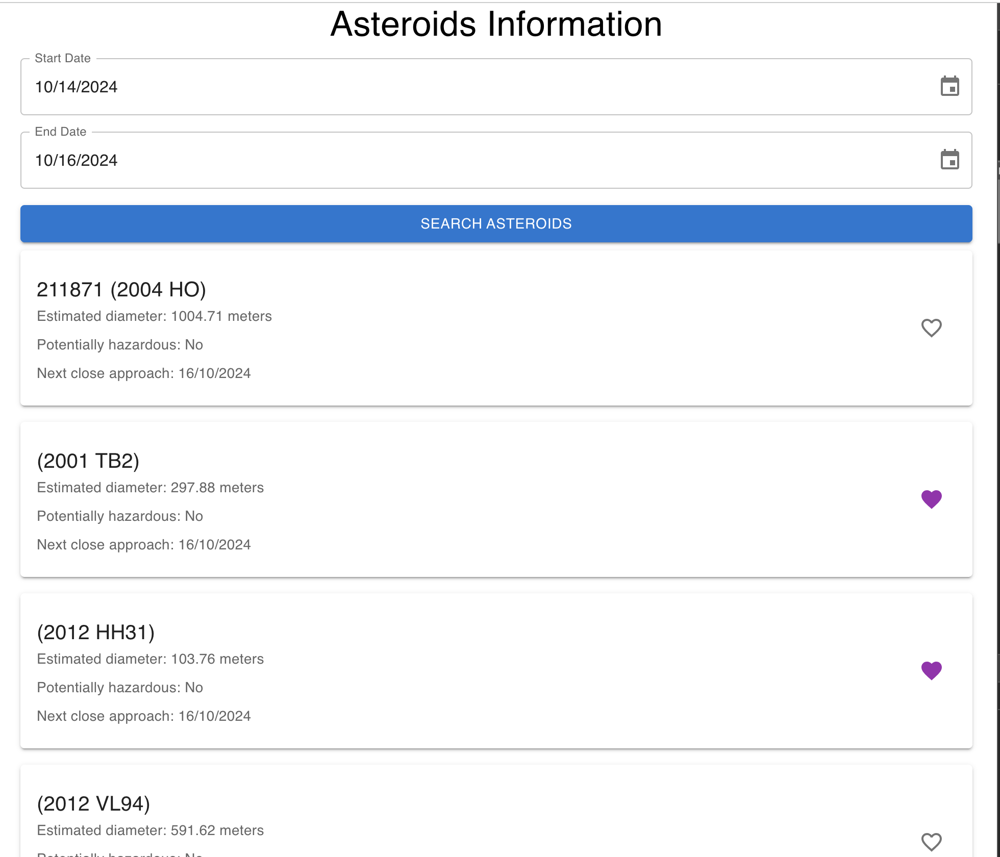
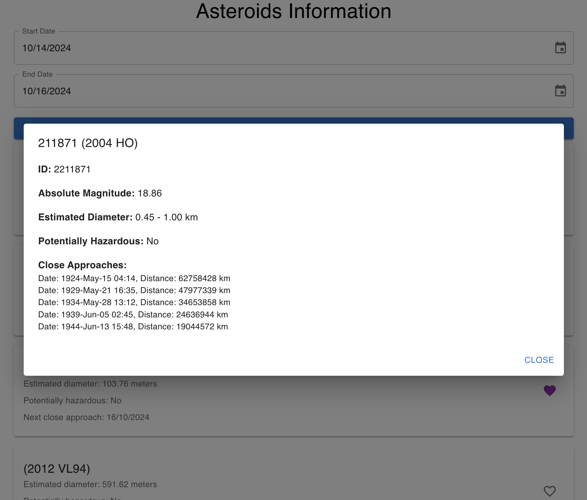

# Asteroid Information App

This project is a Next.js application that provides information about near-Earth asteroids. It allows users to search for asteroids passing close to Earth within a specified date range and displays detailed information about each asteroid.



## Project Overview

The Asteroid Information App fetches data from NASA's Near Earth Object Web Service (NeoWs) API to provide up-to-date information on asteroids. Users can:

- Set a date range for their search
- View a list of asteroids passing near Earth during that period
- See details such as the asteroid's name, estimated diameter, potential hazard status, and next close approach date
- Save favorite asteroids for quick reference



## API Importance

Running the API is crucial for this application to function correctly. The API serves as the bridge between our frontend and NASA's data. It handles:

1. Authentication with NASA's API
2. Data fetching and formatting
3. Caching to improve performance and reduce API calls

Without the API running, the application won't be able to retrieve asteroid information, resulting in a non-functional user experience.

## Getting Started

First, ensure that the API is running. Then, follow these steps to run the development server:

```bash
npm run dev
# or
yarn dev
# or
pnpm dev
# or
bun dev
```

Open [http://localhost:3000](http://localhost:3000) with your browser to see the result.

## Running Unit Tests

This project uses Playwright for end-to-end testing. To run the unit tests, follow these steps:

1. Make sure you have Playwright installed. If not, you can install it with:

```bash
npm install -D @playwright/test
# or
yarn add -D @playwright/test
```

2. Run the tests using the following command:

```bash
npx playwright test
```

This will run all the tests in the `tests` directory.

3. To view the test results in a browser, you can use:

```bash
npx playwright show-report
```

For more information on using Playwright, check out the [Playwright documentation](https://playwright.dev/docs/intro).

## Learn More

To learn more about the technologies used in this project:

- [Next.js Documentation](https://nextjs.org/docs) - learn about Next.js features and API.
- [NASA NeoWs API](https://api.nasa.gov/) - explore NASA's Near Earth Object Web Service.

## Deployment

This project can be easily deployed on the [Vercel Platform](https://vercel.com/new?utm_medium=default-template&filter=next.js&utm_source=create-next-app&utm_campaign=create-next-app-readme). For more details, check out the [Next.js deployment documentation](https://nextjs.org/docs/app/building-your-application/deploying).
